# Rock Paper Scissors

The website Rock Paper Scissors, is a simple page for users to try their hand at a game of Rock Paper Scissors against a CPU opponent. The first player to get to 5 points wins!

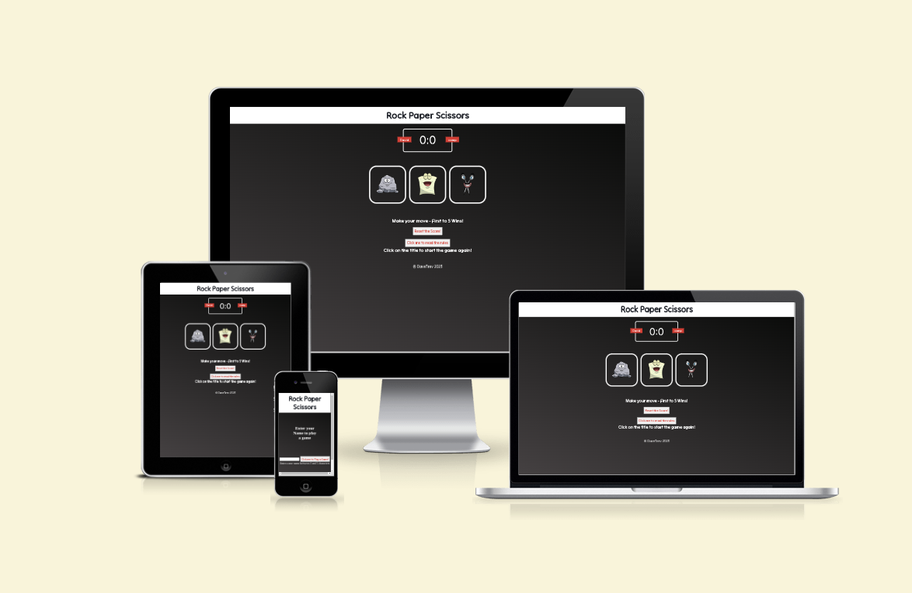

[View Rock Paper Scissors on Github Pages](https://davetrev.github.io/Rock-Paper-Scissors-v2)

## CONTENTS

* [User Experience](#User-Experience)
  * [User Stories](#User-Stories)

* [Design](#Design)
  * [Colour Scheme](#Colour-Scheme)
  * [Typography](#Typography)
  * [Features](#Features)
    * [The Home Page](#The-Home-Page)
    * [The Game Page](#The-Game-Page)
    * [The High Scores Page](#The-High-Scores-Page)
    * [The 404 Error Page](#The-404-Error-Page)
    * [Future Implementations](#Future-Implementations)
    
* [Technologies Used](#Technologies-Used)
  * [Languages Used](#Languages-Used)
  * [Frameworks, Libraries & Programs Used](#Frameworks,-Libraries-&-Programs-Used)
  
* [Deployment & Local Development](#Deployment-&-Local-Development)
  * [Deployment](#Deployment)
  * [Local Development](#Local-Development)
    * [How to Fork](#How-to-Fork)
    * [How to Clone](#How-to-Clone)

* [Testing](#Testing)
* [Fixed Bugs](#Fixed-Bugs)
  * [Known Bugs](#Known-Bugs)
  
* [Credits](#Credits)
  * [Code Used](#Code-Used)
  * [Content](#Content)
  * [Media](#Media)
  * [Acknowledgments](#Acknowledgments)

- - -

## User Experience (UX)

### User Stories

#### First Time Visitor Goals

* I want to play a quick, simple game vs a computer opponent. I want to be able to play on any device, when I want to 
* I want the site to be responsive on any device I use
* I want the site to have a simple design that is easy to navigate.
- - -

## Design

### Colour Scheme
The pages for the are layed out in a simple format, i wanted keep the design to a monochrome fashion with splashes of colour coming from details, such as the scoreboard, buttons and the cartoon figures used for the user selection of Rock, Paper or Scissors.

To breakup the look of the site I used a linear gradient for the background, to provide a more interesting look, while keeping to the plan of a monochrome look by and large.

* I have used (203deg, rgba(8, 9, 8, 1) 0%, rgba(69, 65, 66, 1) 100%) to create a linear gradient.
* I have used `#d34036` as the text colour for button text to make sure remains vibrant and easy to see for users.
* I have used white colour text for the main body text to ensure easy to read text for all users .
* I have used `#ffffff` for the background of the modal rules popup, to create a stark difference between the main page and the popup.
* I have used both black and rgb(12, 12, 12) for the text box in the modal popup box.

### Typography

I have used Google fonts to import the font for the site.
Google Fonts was used to import the chosen fonts for use in the site.

* Through out the site I have used the Google Font [Tilt Neon](https://fonts.google.com/specimen/Tilt+Neon). 
* As it is a simple site, I decided to keep the font style the same across the site.
* I have chosen the font type for a friendly playful look

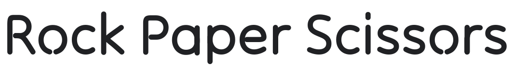

### Features

The website is comprised of a home page, a games page, a 404 error page.

All Pages on the website are responsive and have:

* A favicon that is used for the browser tab.

  

* The title of the site at the top of every page. This title also acts as a link back to the home page.
  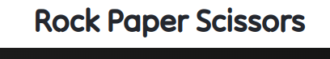

#### The Home Page

The Home page features a name entry feel, to allow the player to put their name on the scoreboard.

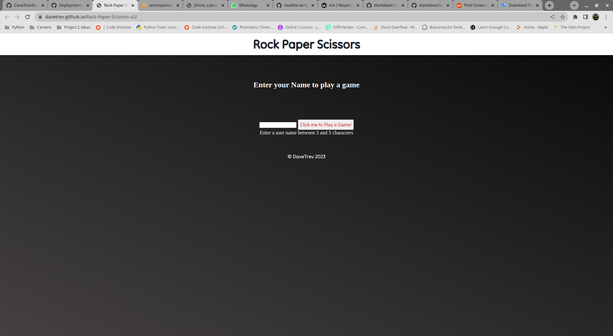

If the user neglects to enter a username, an alert box will show to alert the user to enter their name
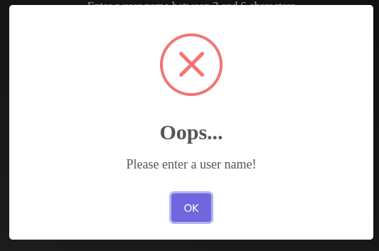

The game section remains hidden, showing when the user enters a name to begin the game.

#### The Game Page

The game page displays a header and a game area. The title of the page links to the index page to reload / restart the game. The score board and character icons are displayed, alongside a text area to display user and cpu choices. A score reset button is featured below this area and a "rules button" which calls a popup box with text featuring the rules of Rock Paper Scissors

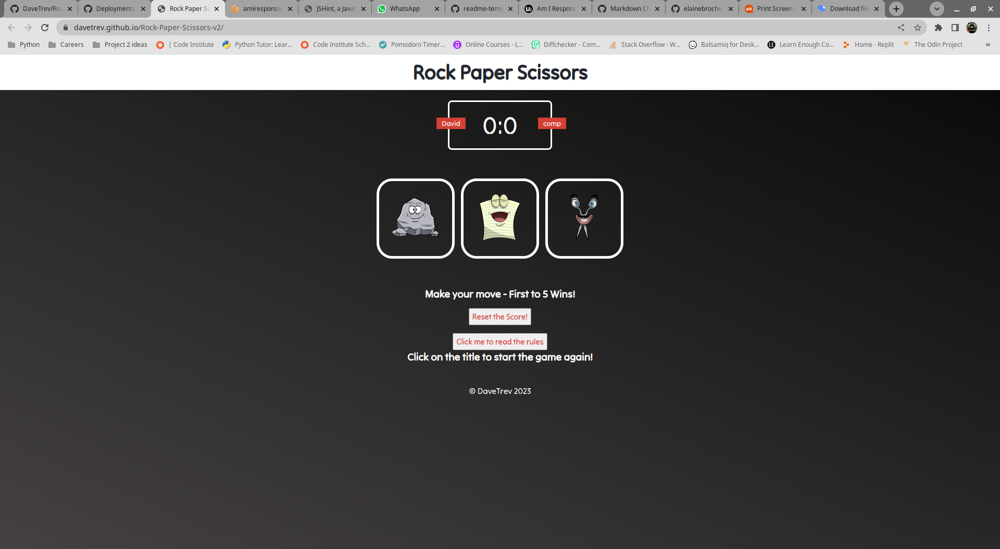
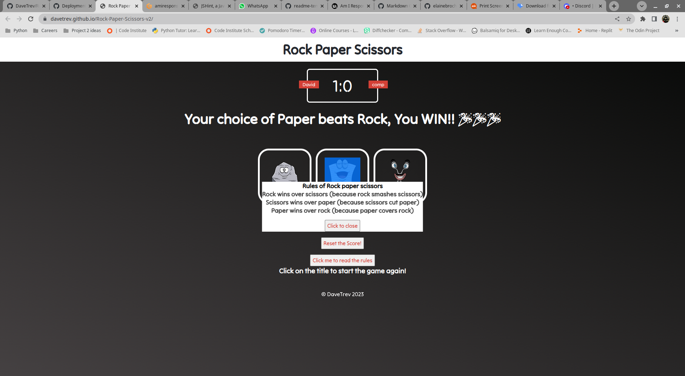

#####  Win, lose, draw messages
How the game is progressing and a alert box shows when the win/lose score of five is reached.
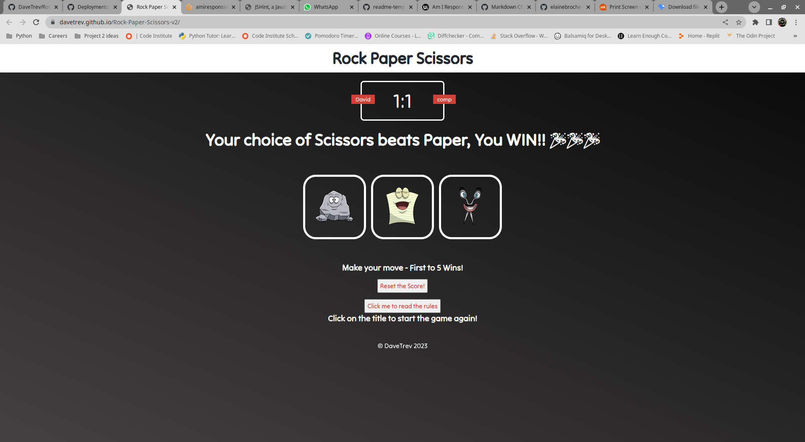
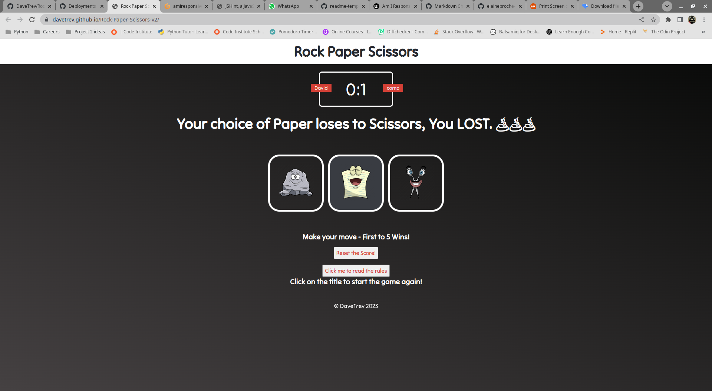
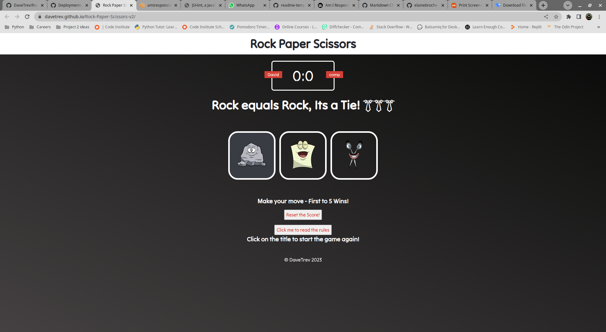
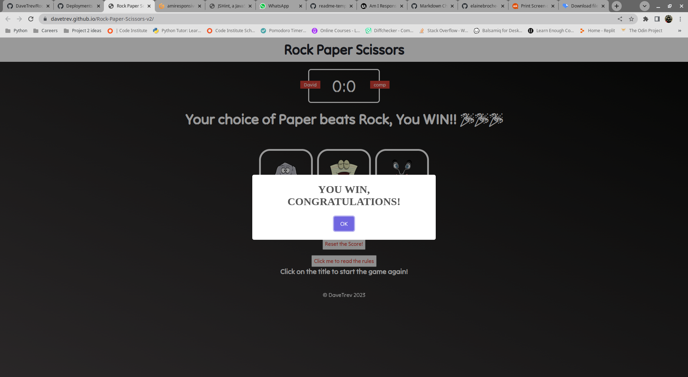
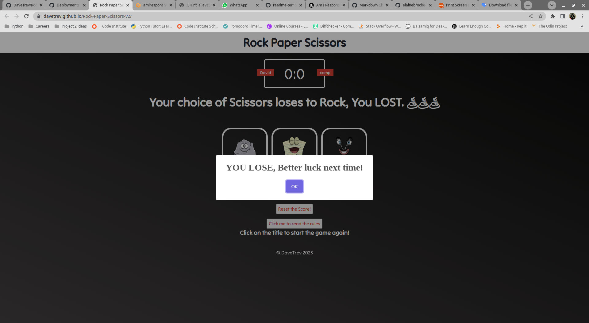

#### The 404 Error Page

I created a very simple 404 page, if the user has navigated to the wrong page for some reason they can click on the header text to return to reload the page to user name entry

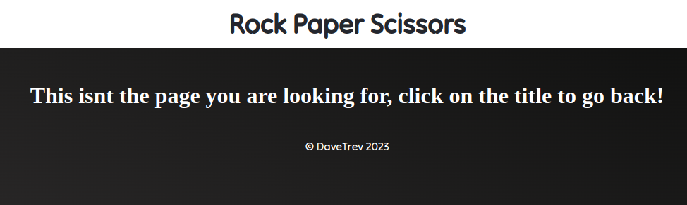

#### Future Implementations

In future implementations I would like to:

1. Give an option to either play against the CPU or a friend.
2. Keeping a log of scores of unbroken win streaks of human players.

## Technologies Used

### Languages Used

HTML, CSS, Javascript

### Frameworks, Libraries & Programs Used

* [Github](https://github.com/) - To save and store the files for the website.

* [GitPod](https://gitpod.io/) - IDE used to create the site.

* [Google Fonts](https://fonts.google.com/) - To import the fonts used on the website.

* [Sweet Alert 2](https://sweetalert2.github.io/) - A responsive, customizable replacement for alert popup boxes.

* [Google Developer Tools](https://developers.google.com/web/tools) - To troubleshoot and test features, solve issues with responsiveness and styling.

* [iloveimg](https://www.iloveimg.com/crop-image) - To resize and crop images

* [Favicon.io](https://favicon.io/) - To create favicon for browser tab

* [Am I Responsive?](http://ami.responsivedesign.is/) - To show the website image on a range of devices.

* [Pixlr.com](https://pixlr.com/x/#editor) - To edit image sizes.

* [Clipartmax.com](https://www.clipartmax.com) - For the royalty free clipart images to use as icons for the game.

* [emojipedia.org](https://emojipedia.org) - Used as a source for the emojis displayed during game play.

* [Stackedit](https://stackedit.io/) - A browser based Markdown editor.

* [FontAwesome](https://fontawesome.com/) - Used for Icons.

- - -

## Deployment & Local Development

### Deployment

The site is deployed using GitHub Pages - [Rock-Paper-Scissors](https://davetrev.github.io/Rock-Paper-Scissors-v2/).

To Deploy the site using GitHub Pages:

1. Login (or signup) to Github.
2. Go to the repository for this project, [DaveTrev/Rock-Paper-Scissors-v2](https://github.com/DaveTrev/Rock-Paper-Scissors-v2).
3. Click the settings button.
4. Select pages in the left hand navigation menu.
5. From the source dropdown select main branch and press save.
6. The site has now been deployed, please note that this process may take a few minutes before the site goes live.

### Local Development

#### How to Fork

To fork the repository:

1. Log in (or sign up) to Github.
2. Go to the repository for this project, [DaveTrev/Rock-Paper-Scissors-v2](https://github.com/DaveTrev/Rock-Paper-Scissors-v2)
3. Click the Fork button in the top right corner.

#### How to Clone

To clone the repository:

1. Log in (or sign up) to GitHub.
2. Go to the repository for this project, [DaveTrev/Rock-Paper-Scissors-v2](https://github.com/DaveTrev/Rock-Paper-Scissors-v2)
3. Click on the code button, select whether you would like to clone with HTTPS, SSH or GitHub CLI and copy the link shown.
4. Open the terminal in your code editor and change the current working directory to the location you want to use for the cloned directory.
5. Type 'git clone' into the terminal and then paste the link you copied in step 3. Press enter.

- - -
# **Testing**
The Site has been tested on Chrome and Firefox, using Devtools in Chrome and Chrome on Android. 

### Responsiveness

Keeping the design of the central to the page, allowed the page to remain mobile responsive aswell as displaying well on desktop and tablet. Although on the Galaxy Fold in Chrome DevTools the site displays poorly with all icons inline.

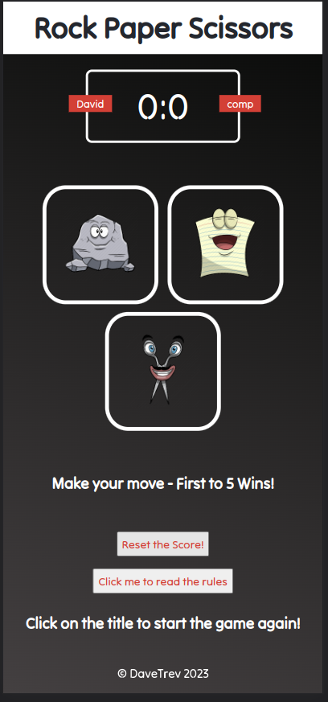

### Lighthouse
The site has been tested with Lighthouse for both desktop and mobile versions, scoring between 99-100. 
## Desktop
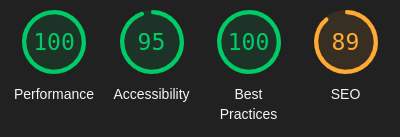
## Mobile
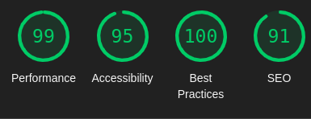

### **Validators**
All HTML files were run through (https://validator.w3.org/#validate_by_input)
CSS file was run through (https://jigsaw.w3.org/css-validator/#validate_by_input) to ensure all code meet the correct standard. No errors or warnings were found for HTML or CSS. 
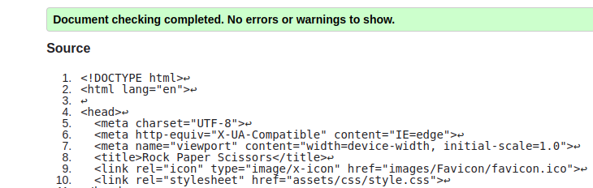
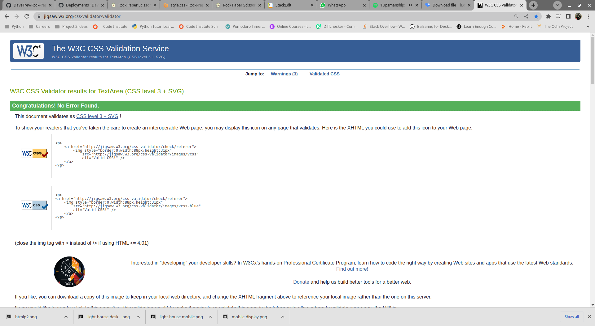
The JavaScript file, was run through (https://jshint.com/) and showed no errors. Swal, used for the Sweet Alert 2, is stated as an undefined variable since it is an external file, declared in a third party library. 
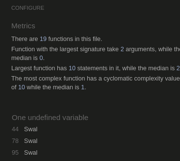

## **Bugs**
During the development of Rock, Paper, Scissors I encountered numerous obstacles and bugs. The main ones are listed below. 
    
### Fixed Bugs

* Bug: Unused variables calling to the html page had to be removed to remove warning.  
* Fix: Rewriting the code on both the html and JavaScript files to use and id in html and define a event listener in the JavaScript solved the issue. 

* Bug: Letting a user enter a name with unlimited characters causes conflict in the scoreboard area positioning
* Fix: Setting a input limit on the characters allowed in the field solved the issue. I would like to return to this issue as I am sure a more elegant solution exists.

* Bug: In setting up the modal via the Florin Pop guide, the background of the modal and positioning of the modal caused it to fall off the screen on desktop and mobile.
* Fix: Rewriting Css and restyling the modal to improve how it displays for the user.

* Bug: Blank spaces were accepted in the input field for the user name
* Fix:  Adding .trim() to the script removed the ability of the user to enter a blank name

* Bug: Poor icon display with original size of images.
* Fix: Improving icon position on mobile I edited and reduced clip art style to 100px x 100 px. 

### Known Bugs
* Onclick="reset()" on index.html is not causing any error or undeclared issue in the JS file. 
* Area for user name entry moves slightly depending on text entered, Possible fix in justifying position of the text area. When I have more time I will return to fix this issue
* Display on a simulated Samsung Galaxy Fold, is poor as the icons display in a vertical column, a media query is needed to solve this issue
* Footer floating on mobile view - Last minute bug, dont have time to fix before submission. Changed Css to position footer but not happy with placement 

## Credits

### Code Used
The Rock, Paper, Scissors game was inspired by (https://www.youtube.com/watch?v=jaVNP3nIAv0) and a guide to making a modal popup (https://www.youtube.com/watch?v=MBaw_6cPmAw&t=27s). I have tried to deviate as much as possible and add additional features and functions, some similarities in the code may still exist.

###  Media

All images for the icon creation came from the following sources 
Rock - (https://www.clipartmax.com/download/m2H7Z5K9A0Z5K9A0_cartoon-rock-paper-scissors/)
Scissors - (https://www.clipartmax.com/download/m2i8d3Z5A0N4H7b1_scissors-cartoon-cartoon-rock-paper-scissors/)
Paper - (https://www.clipartmax.com/middle/m2i8d3Z5i8i8Z5K9_cartoon-emoji-paper-rock-scissors-icon-rock-paper-scissors-emoji/)
emojis taken from
- Party - (https://emojipedia.org/party-popper/)
- Tie - (https://emojipedia.org/necktie/)
- Poo - (https://emojipedia.org/pile-of-poo/)
For a guide to writing this readme my mentor suggested using a fellow Code Institute students layout. (https://github.com/kera-cudmore/Bully-Book-Club#Testing)
All other content for the site, such as introduction messages and instructions were written by myself.

### Acknowledgments
* I would like to thank my mentor [Jubril  Akolade](https://github.com/Jubrillionaire) whos support and patience helped guide me through this project.
* Also a big thank you to [Brian Kilduff](https://github.com/MistaKD) who was a fantastic sounding board when I was facing issues that I couldn't figure out and doubted getting passed them!

- - -
